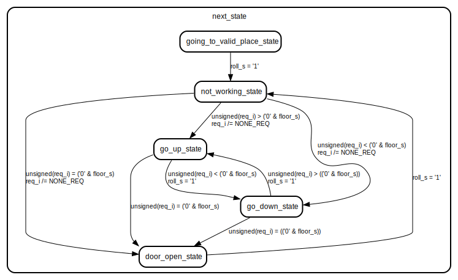

# Elevator-Control

This project includes the RTL Design, Validation, and Implementation of an Elevator Controller.
it supports any arbirataty number of floors and can specified with the generic N parameter with each floor containing up and down buttons

## design

It contains 2 main parts the Control Unit and the Resolver.

 
 

# Control Unit

## Diagram

## Generics

| Generic name | Type    | Value      |
| ------------ | ------- | ---------- |
| N            | integer | 10         |
| clk_freq     | integer | 50_000_000 |

## Ports

| Port name | Direction | Type                                                        |
| --------- | --------- | ----------------------------------------------------------- |
| clk       | in        | std_logic                                                   |
| reset_n   | in        | std_logic                                                   |
| req_i     | in        | std_logic_vector(integer(ceil(log2(real(N)))) downto 0)     |
| mv_up     | out       | std_logic                                                   |
| mv_down   | out       | std_logic                                                   |
| door_open | out       | std_logic                                                   |
| floor     | out       | std_logic_vector(integer(ceil(log2(real(N)))) - 1 downto 0) |

## Instantiations

- U1: one_sec_timer
- floor_counter_inst: component floor_counter

## State machine

## 

 
 

# The Resolver

it takes all the buttons and outputs only one single request to the control unit

## Generics

| Generic name | Type    | Value |
| ------------ | ------- | ----- |
| N            | integer | 10    |

## Ports

| Port name | Direction | Type                                                        |
| --------- | --------- | ----------------------------------------------------------- |
| clk       | in        | std_logic                                                   |
| reset_n   | in        | std_logic                                                   |
| ups       | in        | std_logic_vector(N - 1 downto 0)                            |
| downs     | in        | std_logic_vector(N - 1 downto 0)                            |
| buttons   | in        | std_logic_vector(N - 1 downto 0)                            |
| mv_up     | in        | std_logic                                                   |
| mv_down   | in        | std_logic                                                   |
| door_open | in        | std_logic                                                   |
| floor     | in        | std_logic_vector(integer(ceil(log2(real(N)))) - 1 downto 0) |
| req       | out       | std_logic_vector(integer(ceil(log2(real(N)))) downto 0)     |

## Instantiations

- U1: resolver_comb

## State machine

