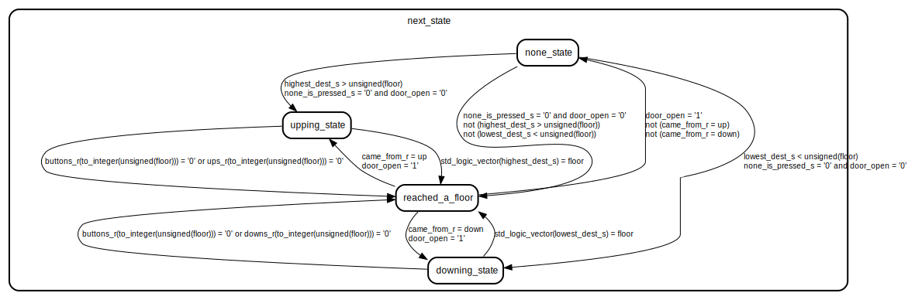

# Entity: resolver_fsm 

- **File**: resolver_fsm.vhd
## Diagram

## Generics

| Generic name | Type    | Value | Description |
| ------------ | ------- | ----- | ----------- |
| N            | integer | 10    |             |
## Ports

| Port name | Direction | Type                                                        | Description |
| --------- | --------- | ----------------------------------------------------------- | ----------- |
| clk       | in        | std_logic                                                   |             |
| reset_n   | in        | std_logic                                                   |             |
| ups       | in        | std_logic_vector(N - 1 downto 0)                            |             |
| downs     | in        | std_logic_vector(N - 1 downto 0)                            |             |
| buttons   | in        | std_logic_vector(N - 1 downto 0)                            |             |
| mv_up     | in        | std_logic                                                   |             |
| mv_down   | in        | std_logic                                                   |             |
| door_open | in        | std_logic                                                   |             |
| floor     | in        | std_logic_vector(integer(ceil(log2(real(N)))) - 1 downto 0) |             |
| req       | out       | std_logic_vector(integer(ceil(log2(real(N)))) downto 0)     |             |
## Signals

| Name              | Type                                                    | Description |
| ----------------- | ------------------------------------------------------- | ----------- |
| current_state     | state_type                                              |             |
| next_state        | state_type                                              |             |
| came_from_s       | came_from_type                                          |             |
| came_from_r       | came_from_type                                          |             |
| none_is_pressed_s | std_logic                                               |             |
| highest_dest_s    | unsigned(integer(ceil(log2(real(N)))) - 1 downto 0)     |             |
| lowest_dest_s     | unsigned(integer(ceil(log2(real(N)))) - 1 downto 0)     |             |
| req_s             | std_logic_vector(integer(ceil(log2(real(N)))) downto 0) |             |
| ups_s             | std_logic_vector(N - 1 downto 0)                        |             |
| downs_s           | std_logic_vector(N - 1 downto 0)                        |             |
| buttons_s         | std_logic_vector(N - 1 downto 0)                        |             |
| req_r             | std_logic_vector(integer(ceil(log2(real(N)))) downto 0) |             |
| ups_r             | std_logic_vector(N - 1 downto 0)                        |             |
| downs_r           | std_logic_vector(N - 1 downto 0)                        |             |
| buttons_r         | std_logic_vector(N - 1 downto 0)                        |             |
## Constants

| Name     | Type                                                    | Value           | Description |
| -------- | ------------------------------------------------------- | --------------- | ----------- |
| NONE_REQ | std_logic_vector(integer(ceil(log2(real(N)))) downto 0) | (others => '1') |             |
## Types

| Name           | Type                                                                                                                                                                   | Description |
| -------------- | ---------------------------------------------------------------------------------------------------------------------------------------------------------------------- | ----------- |
| state_type     | (none_state,  upping_state,  downing_state,  reached_a_floor) |             |
| came_from_type | (none,  up,  down)                                                                               |             |
## Processes
- clk_p: ( clk )
- state_p: ( door_open, lowest_dest_s, current_state, downs, ups, floor, highest_dest_s, none_is_pressed_s, buttons, req_r, came_from_r, buttons_r, downs_r, ups_r )
## Instantiations

- U1: resolver_comb
## State machines

