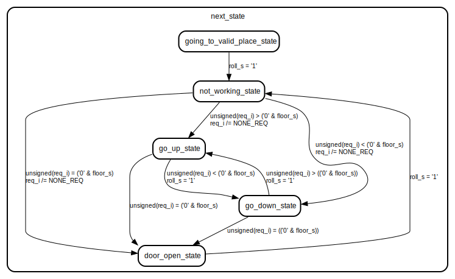

# Entity: unit_control 

- **File**: unit_control.vhd
## Diagram

## Generics

| Generic name | Type    | Value      | Description |
| ------------ | ------- | ---------- | ----------- |
| N            | integer | 10         |             |
| clk_freq     | integer | 50_000_000 |             |
## Ports

| Port name | Direction | Type                                                        | Description |
| --------- | --------- | ----------------------------------------------------------- | ----------- |
| clk       | in        | std_logic                                                   |             |
| reset_n   | in        | std_logic                                                   |             |
| req_i     | in        | std_logic_vector(integer(ceil(log2(real(N)))) downto 0)     |             |
| mv_up     | out       | std_logic                                                   |             |
| mv_down   | out       | std_logic                                                   |             |
| door_open | out       | std_logic                                                   |             |
| floor     | out       | std_logic_vector(integer(ceil(log2(real(N)))) - 1 downto 0) |             |
## Signals

| Name                 | Type                                                | Description |
| -------------------- | --------------------------------------------------- | ----------- |
| current_state        | state_type                                          |             |
| next_state           | state_type                                          |             |
| timer_reset          | std_logic                                           |             |
| floor_counter_enable | std_logic                                           |             |
| roll_s               | std_logic                                           |             |
| add_or_sub_s         | std_logic                                           |             |
| mv_up_r              | std_logic                                           |             |
| mv_down_r            | std_logic                                           |             |
| door_open_r          | std_logic                                           |             |
| mv_up_s              | std_logic                                           |             |
| mv_down_s            | std_logic                                           |             |
| door_open_s          | std_logic                                           |             |
| floor_s              | unsigned(integer(ceil(log2(real(N)))) - 1 downto 0) |             |
## Constants

| Name     | Type                                                    | Value           | Description |
| -------- | ------------------------------------------------------- | --------------- | ----------- |
| NONE_REQ | std_logic_vector(integer(ceil(log2(real(N)))) downto 0) | (others => '1') |             |
## Types

| Name       | Type                                                                                                                                                                                                                                         | Description |
| ---------- | -------------------------------------------------------------------------------------------------------------------------------------------------------------------------------------------------------------------------------------------- | ----------- |
| state_type | (going_to_valid_place_state,  not_working_state,  go_up_state,  go_down_state,  door_open_state) |             |
## Processes
- unnamed: ( clk )
- state_transitions_process: ( door_open_r, current_state, mv_up_r, mv_down_r, req_i, floor_s, roll_s )
## Instantiations

- U1: one_sec_timer
- floor_counter_inst: component floor_counter
## State machines

